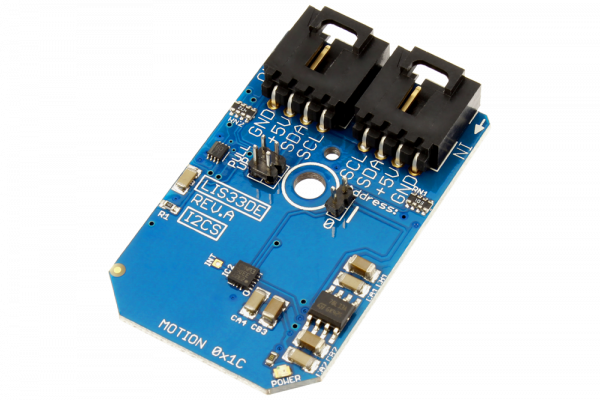

# LIS33DE

Manufactured by STMicroelectronics, the LIS33DE is a low-power three axis linear accelerometer belonging to the “nano” family. The LIS33DE has dynamically user selectable full scales of ±2g/±8g and it is capable of measuring accelerations with an output data rate of 100 Hz or 400 Hz. 
This Device is available from www.ncd.io 

[SKU: LIS33DE_I2CS]

(https://store.ncd.io/product/lis33de-motion-sensor-3-axis-%C2%B12g%C2%B18g-accelerometer-i2c-mini-module/)
This Sample code can be used with Arduino.

Hardware needed to interface LIS33DE sensor with Arduino

1. <a href="https://store.ncd.io/product/i2c-shield-for-arduino-nano/">Arduino Nano</a>

2. <a href="https://store.ncd.io/product/i2c-shield-for-arduino-micro-with-i2c-expansion-port/">Arduino Micro</a>

3. <a href="https://store.ncd.io/product/i2c-shield-for-arduino-uno/">Arduino uno</a>

4. <a href="https://store.ncd.io/product/dual-i2c-shield-for-arduino-due-with-modular-communications-interface/">Arduino Due</a>

5. <a href="https://store.ncd.io/product/lis33de-motion-sensor-3-axis-%C2%B12g%C2%B18g-accelerometer-i2c-mini-module/">LIS33DE 3Axis Motion And Accelometer Sensor</a>

6. <a href="https://store.ncd.io/product/i%C2%B2c-cable/">I2C Cable</a>

LIS33DE:

Manufactured by STMicroelectronics, the LIS33DE is a low-power three axis linear accelerometer belonging to the “nano” family. The LIS33DE has dynamically user selectable full scales of ±2g/±8g and it is capable of measuring accelerations with an output data rate of 100 Hz or 400 Hz. 

Applications:

• Portrait - landascape image rotation in mobile phones and PDA

• Motion activated user interfaces

• Gaming

• Motion triggered wake-up

How to Use the LIS33DE Arduino Library

The LIS33DE has a number of settings, which can be configured based on user requirements.
          
1.Data rate setting:The following command is used to set the data rate.

            lis.setAccelDataRate(ACCEL_DATARATE_100HZ);             // AODR (Hz): 100
            
2.Accleration range selection:The following command is used to select the range of acceleration.

           lis.setAccelRange(ACCEL_RANGE_2G);                      // ±2 G
         
